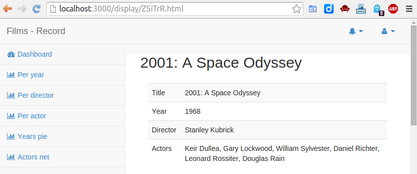

There is an URL to display a document, which identifier is, say, `id`, it is
ended with `/display/id.html` (you can replace `html` with `json` if you want
to see what is stored in the database).

## Title
To indicate the title of a document, use the `documentFields` named `$title`.

## Fields

In order to make the `/display/id.html` page work, you have to declare all the
fields you want in the document's page.

They have to be in `display.fields`, they'll be displayed in the same
order as their declaration's order.

Use `"path": "label"`

Ex:

```json
{
  "display" : {
    "fields" : {
      "title": "Title",
      "authors": "Authors",
      "year": "Publication Year",
      "content.json.SourceCorrigee": "Source",
      "content.json.DiscESI": "Theme",
      "content.json.SectionEtude": "INSU Section",
      "content.json.La": "Publication Language",
      "content.json.PaysFRERegroupe": "Country",
      "content.json.Di": "DOI",
      "content.json.Ut": "WoS Identifier"
    }
  }
}
```



To change the fields column's width, use `fieldsWidth` within `display` key:

```json
{
  "display": {
    "fields": {
      "title"   : "Title",
      "year"    : "Year",
      "director": "Director",
      "vactors" : "Actors"
    },
    "fieldsWidth": "50%"
  }
}
```

Any CSS width will work. However, be aware that it is preferable to let it be
responsive.
