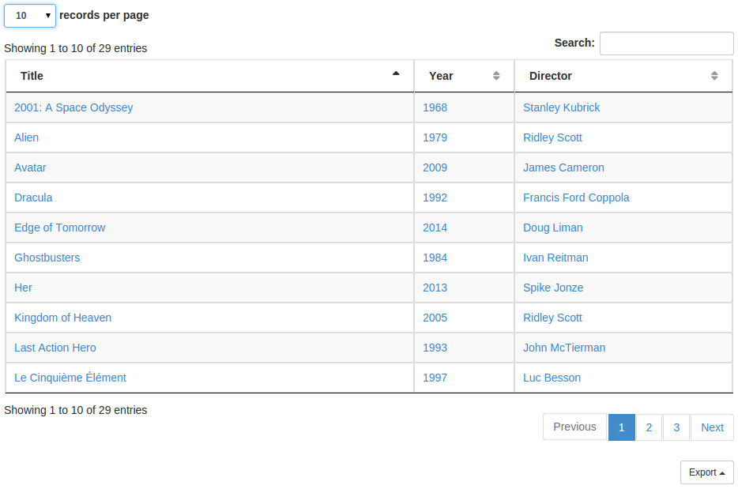

In `/chart.html` pages, you can see a chart, and a table with documents. This table display the fields you chose to put in the `documentFields` key.
This table is also the only element present in `/documents.html` page.

Here is an example, displaying `Year`, `Title`, `Authors`, and `Keywords`:

```javascript
"documentFields" : {
  "$year"   : {
    "visible": true,
    "label": "Publication Year",
    "path" : "content.json.Py"
  },
  "$title"  : {
    "visible": true,
    "label": "Title",
    "path" : "content.json.Ti"
  },
  "$authors": {
    "visible": true,
    "label": "Authors",
    "path" : "content.json.Af"
  },
  "$keywords" : {
    "visible": true,
    "label": "Keywords",
    "path" : "content.json.DiscESI"
  }
}
```

All *document fields* which `visible` key is set to `true` will be
present in the table.

By default, `visible` key value is `false`.

The `Search` field above the documents table uses a field named
[`text`](DocumentFields.md#text), which must contain the content of all fields
you want to be able to search.

Ex:

```javascript
"documentFields" : {
  "$text": {
    "get" : ["content.json.Py", "content.json.Ti", "content.json.Af"],
    "join": "|"
  }
}
```
