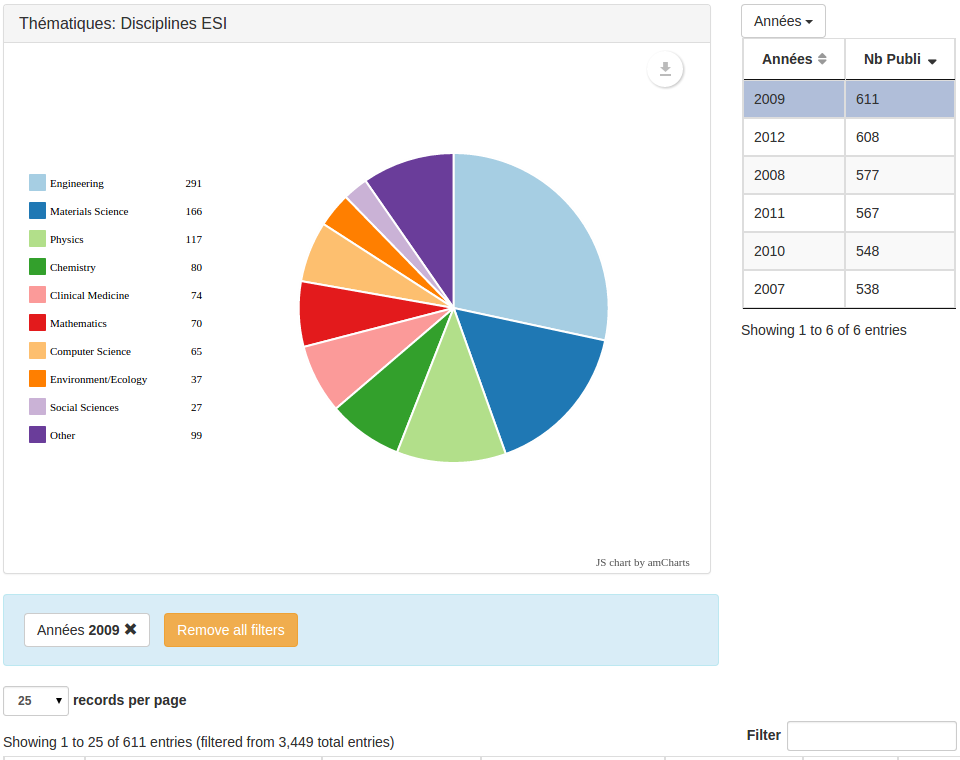

In a chart page, you can add facets: others fields' values.

Thus, you can have facets in each chart. Example:

```javascript
  "charts": [
    {
      "field": "fields.Section",
      "type": "pie",
      "title": "Sections",
      "facets": [
        {
          "path": "content.json.Py",
          "label": "Year",
          "help": "Production per year",
          "paging": false
        },
        {
          "path": "fields.Themes",
          "label": "Theme",
          "column2": "#Publi"
        }
      ]
    },
```

Here, you have a pie displaying sections, and two facets:

1. pointing to `content.json.Py`  in the document
2. pointing to `fields.Theme`  in the document

The first facet has a `help` field, which will appear as a tooltip.

The first facet won't have pagination buttons, as its `paging` field is set to
`false` (this is useful when there is only one page to display).

The second facet changes the lable of its second columns to `#Publi`, instead
of `Occ` by default.
