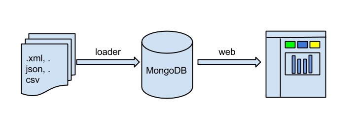

The GitHub repository named 
[getting-started-with-ezvis](https://github.com/madec-project/getting-started-with-ezvis)
has an example to quickly see what can be done with ezVIS.

# Get example

To get the example, several methods are available:

- git clone

    ```
    $ git clone https://github.com/madec-project/getting-started-with-ezvis.git
    ```

- zip: get the [zip file](https://github.com/madec-project/getting-started-with-ezvis/archive/master.zip) and unzip it.

- tar.gz: get the [tar.gz](https://github.com/madec-project/getting-started-with-ezvis/archive/master.tar.gz) and unzip it:

    ```
    $ tar xvzf getting-started-with-ezvis-master.tar.gz
    ```

# Visit one example

Then go into the repository from the Command Prompt:

```sh
$ cd getting-started-with-ezvis
```

Then launch ezVIS's web server:

```sh
$ ezvis films
```

and point your browser to [http://localhost:3000/](http://localhost:3000/).

The file in the `films` directory (`films.csv`) is loaded into MongoDB at ezVIS launching. Then it is served in the form of a web report:



Both loader and web application are configurated in the `films.json`.

If you want to go farther, take a look at the `films.json` file, which
contains all the report's configuration (which is explained later in this
documentation).

And there are more examples (often including data) in the [showcase](https://github.com/madec-project/showcase/).
