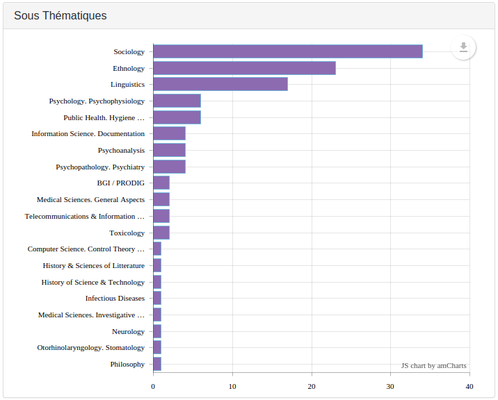

Used to display the number of documents associated to a field value (for
example, for keywords: how many documents match a keyword?).
Bars are sorted by descending number of documents.

Possible configuration: [`size`](Preferences.md#size), [`color`](Preferences.md#color), and `maxItems`.

`maxItems` limits the number of bars to its value (default value: `100`).

If you want to shorten the field value to display on the chart, use an
associative array to replace too long fields values with shorter ones:

```javascript
      {
        "field": "fields.Themes",
        "type": "horizontalbars",
        "title": "Themes (bars)",
        "maxItems" : 10,
        "labels": {
          "Biology & Biochemistry"    : "Bio & Bio",
          "Pharmacology & Toxicology" : "Pharmaco & Toxico",
          "Plant & Animal Science"    : "Plant & Animal"
        }
      },
```
