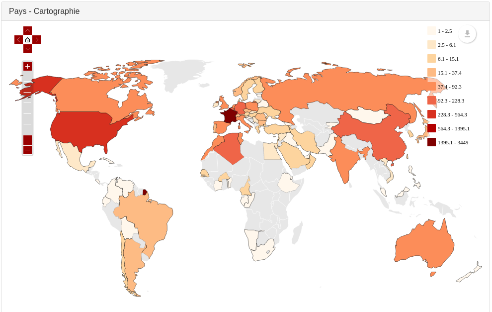

Used to project country-related numbers on a geographical map.

At the moment, there is only one usable map: "world".

To be able to project the numbers to the areas on the map, you have to match
numbers and ISO-36166-1 ALPHA-3 codes. To do this, you may need the `mapping`
key in the declaration of a new `documentFields` instance.

Here an example:

```javascript
  "dashboard" : {
    "charts": [
      {
        "type": "map",
        "fields": [ "fields.country" ],
        "title": "Countries map"
      }
    ]
  },
  "documentFields" : {
    "country" : {
      "label": "Country",
      "path" : "content.json.country",
      "parseCSV": ";",
      "foreach" : {
        "mapping": {
          "Afghanistan" : "AFG",
          "Angola": "AGO",
          "Albania" : "ALB",
          "Andorra" : "AND",
          "United Arab Emirates" : "ARE",
          "Argentina" : "ARG",
          "Armenia" : "ARM",
          "Fr. S. and Antarctic Lands" : "ATF",
          "Australia" : "AUS",
          "Austria" : "AUT",
          "Azerbaijan" : "AZE",
          "Burundi" : "BDI",
          "Belgium" : "BEL",
          "Benin": "BEN",
          "Burkina Faso" : "BFA",
          "Bangladesh": "BGD",
          "Bulgaria" : "BGR",
          "Bosnia and Herz." : "BIH",
          "Belarus" : "BLR",
          "Belize" : "BLZ",
          "Bolivia": "BOL",
          "Brazil" : "BRA",
          "Brunei" : "BRN",
          "Bhutan" : "BTN",
          "Botswana" : "BWA",
          "Central African Republic": "CAF",
          "Canada" : "CAN",
          "Switzerland" : "CHE",
          "Chile" : "CHL",
          "People's Republic of China" : "CHN",
          "Ivory Coast" : "CIV",
          "Cameroon": "CMR",
          "Zaire" : "COD",
          "Congo" : "COG",
          "Colombia" : "COL",
          "Costa Rica" : "CRI",
          "Cuba" : "CUB",
          "N. Cyprus" : "CYN",
          "Cyprus" : "CYP",
          "Czech Republic": "CZE",
          "Germany" : "DEU",
          "Djibouti" : "DJI",
          "Denmark" : "DNK",
          "Dominican Rep." : "DOM",
          "Algeria" : "DZA",
          "Ecuador": "ECU",
          "Egypt" : "EGY",
          "Eritrea" : "ERI",
          "Spain" : "ESP",
          "Estonia" : "EST",
          "Ethiopia" : "ETH",
          "Finland" : "FIN",
          "Falkland Is." : "FLK",
          "France" : "FRA",
          "Gabon": "GAB",
          "Gaza" : "GAZ",
          "United Kingdom" : "GBR",
          "Georgia" : "GEO",
          "Ghana": "GHA",
          "Guinea" : "GIN",
          "Gambia" : "GMB",
          "Guinea Bissau" : "GNB",
          "Eq. Guinea" : "GNQ",
          "Greece": "GRC",
          "Greenland" : "GRL",
          "Guatemala": "GTM",
          "Guyana" : "GUY",
          "Hong Kong" : "HKG",
          "Honduras" : "HND",
          "Croatia" : "HRV",
          "Haiti" : "HTI",
          "Hungary": "HUN",
          "Iceland": "ISL",
          "India": "IND",
          "Indonesia": "IDN",
          "Ireland": "IRL",
          "Iran": "IRN",
          "Iraq" : "IRQ",
          "Israel": "ISR",
          "Italy" : "ITA",
          "Jamaica" : "JAM",
          "Jordan": "JOR",
          "Japan" : "JPN",
          "Kazakhstan" : "KAZ",
          "Kenya" : "KEN",
          "Kyrgyzstan" : "KGZ",
          "Cambodia" : "KHM",
          "South Korea" : "KOR",
          "Kosovo" : "KOS",
          "Kuwait" : "KWT",
          "Laos"  : "LAO",
          "Lebanon" : "LBN",
          "Liberia" : "LBR",
          "Libya" : "LBY",
          "Liechtenstein" : "LIE",
          "Sri Lanka" : "LKA",
          "Lesotho" : "LSO",
          "Lithuania" : "LTU",
          "Luxembourg" : "LUX",
          "Latvia" : "LVA",
          "Macau" : "MAC",
          "St. Martin" : "MAF",
          "Morocco" : "MAR",
          "Monaco" : "MCO",
          "Moldova" : "MDA",
          "Madagascar" : "MDG",
          "Mexico" : "MEX",
          "Macedonia, the Former Yugoslave Republic of": "MKD",
          "Mali" : "MLI",
          "Myanmar" : "MMR",
          "Montenegro" : "MNE",
          "Mongolia" : "MNG",
          "Mozambique" : "MOZ",
          "Mauritania" : "MRT",
          "Malawi" : "MWI",
          "Malaysia" : "MYS",
          "Namibia" : "NAM",
          "New Caledonia" : "NCL",
          "Niger" : "NER",
          "Nigeria" : "NGA",
          "Nicaragua" : "NIC",
          "Netherlands" : "NLD",
          "Norway" : "NOR",
          "Nepal" : "NPL",
          "New Zealand" : "NZL",
          "Oman" : "OMN",
          "Pakistan" : "PAK",
          "Panama" : "PAN",
          "Peru": "PER",
          "Philippines" : "PHL",
          "Papua New Guinea" : "PNG",
          "Poland": "POL",
          "N. Korea" : "PRK",
          "Portugal" : "PRT",
          "Paraguay" : "PRY",
          "Qatar" : "QAT",
          "Romania" : "ROU",
          "Russia" : "RUS",
          "Rwanda" :  "RWA",
          "W. Sahara" : "SAH",
          "Saudi Arabia" : "SAU",
          "Sudan" : "SDN",
          "S. Sudan" : "SDS",
          "Senegal" : "SEN",
          "Sierra Leone" : "SLE",
          "El Salvador" : "SLV",
          "Somaliland" : "SOL",
          "Somalia" : "SOM",
          "Serbia" : "SRB",
          "Suriname" : "SUR",
          "Slovakia" : "SVK",
          "Slovenia" : "SVN",
          "Sweden" : "SWE",
          "Swaziland" : "SWZ",
          "Sint Maarten" : "SXM",
          "Syria" : "SYR",
          "Chad" : "TCD",
          "Togo" : "TGO",
          "Thailand" : "THA",
          "Tibet" : "TIB",
          "Tajikistan" : "TJK",
          "Turkmenistan" : "TKM",
          "East Timor" : "TLS",
          "Trinidad and Tobago" : "TTO",
          "Tunisia" : "TUN",
          "Turkey" : "TUR",
          "Taiwan" : "TWN",
          "Tanzania" : "TZA",
          "Uganda" : "UGA",
          "Ukraine" : "UKR",
          "Uruguay" : "URY",
          "United States" : "USA",
          "Uzbekistan" : "UZB",
          "Venezuela" : "VEN",
          "Vietnam" : "VNM",
          "West Bank" : "WEB",
          "Yemen" : "YEM",
          "South Africa" : "ZAF",
          "Zambia" : "ZMB",
          "Zimbabwe" : "ZWE"
        }
      }
    }
  }
```

You can use the [`colors`](Preferences.md#colors) option to set the color scale.
