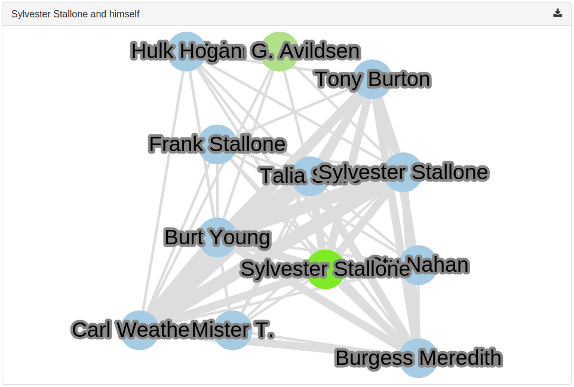

ex:

Classical Network, with all links (at least until 100k).

```javascript
      {
        "type": "network",
        "fields": [ "actors" ],
        "maxItems": 100000,
        "title": "Actors net",
        "help": "Links between actors."
      },
```

Centered Network, where only the actors "near" `Arnold Schwarzenegger` and
`Peter Weller` are visible.

```javascript
      {
        "type": "network",
        "fields": [ "actors" ],
        "maxItems": 100000,
        "title": "Arnold & Peter",
        "help": "Actors linked to Arnold Schwarzenegger and Peter Weller",
        "centerOn": ["Arnold Schwarzenegger", "Peter Weller"]
      }
```

To change the color of a node, in order to make it more visible, add a `nodes`
array, in which each element is an object with a `value` and a `color`
property. If you don't provide a color, their color will be the current one,
saturated.

```javascript
      {
        "type": "network",
        "fields": [ "actors" ],
        "maxItems": 100000,
        "threshold": 3,
        "title": "Actors net with colors",
        "help": "Network of actors, which common films are at least 3, and where Carrie Fisher is highlighed",
        "nodes": [{
          "value": "Carrie Fisher",
          "color": "#33a02c"
        }]
      }
```

You can also precise in which field the value has to be colored.

```javascript
      {
        "type": "network",
        "fields": ["actors", "director"],
        "maxItems": 100000,
        "title": "Sylvester Stallone and himself",
        "help": "A network centered on Sylvester Stallone, as director",
        "centerOn": ["Sylvester Stallone"],
        "nodes": [{
          "field": "director",
          "value": "Sylvester Stallone",
          "color": "red"
        }]
      }
```



Selected Network, where only documents matching the mongodb `selector` are
visible (using a [MongoDB Match Query Criteria](http://docs.mongodb.org/manual/reference/method/db.collection.find/#find-documents-that-match-query-criteria), but within a JSON, thus using
quotes around operators).

```javascript
      {
        "type": "network",
        "fields": [ "actors" ],
        "maxItems": 100000,
        "title": "Actors net 2000",
        "help": "Actors from films after year 2000",
        "selector": {
          "year": { "$gte": "2000" }
        }
      }
```

Threshold Network, where only links above the threshold value are displayed
(in the example: the actors linked are those who played at least in 3 films
together).

```javascript
      {
        "type": "network",
        "fields": [ "actors" ],
        "maxItems": 100000,
        "threshold": 3,
        "title": "Actors net > 3 films",
        "help": "Network of actors, which common films are at least 3"
      }
```

To display several fields in the same network, put their names in the `fields`
property:

```javascript
      {
        "type": "network",
        "fields": [ "director", "year", "title" ],
        "maxItems": 100000,
        "title": "Director, year, films",
        "help": "Network of directors, year and films"
      }
```

### fieldsColor
You can set the color of the nodes field by field.

Example: `actors` field in green and `director` field in blue.

```javascript
      {
        "type": "network",
        "fields": ["actors", "director"],
        "maxItems": 100000,
        "title": "Actors and director colored",
        "help": "A network with actors in green and directors in blue",
        "fieldsColor": {
          "actors": "green",
          "director": "blue"
        }
      }
```
