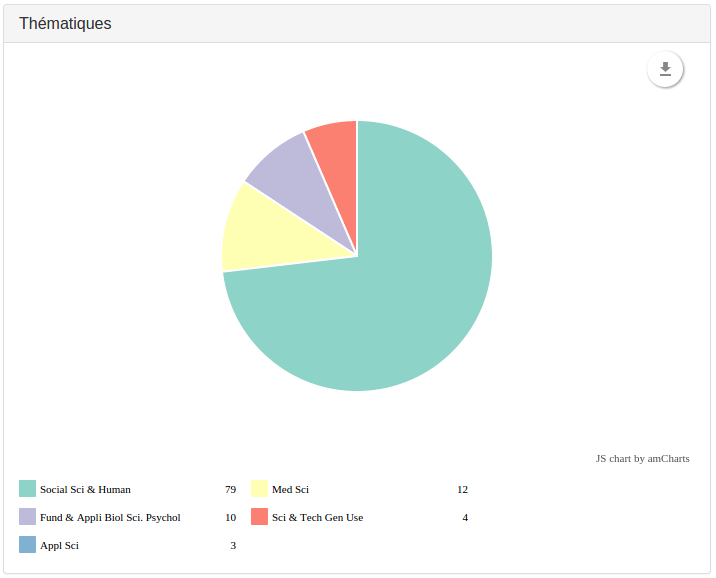

Used to fill the pie chart quarters.

There are some configuration possible: [`size`](Preferences.md#size) of the pie, 
[`colors`](Preferences.md#colors) of the slices, and position of the [`legend`](Preferences.md#legend).

You can also use `groupPercent`: if there is more than one slice whose
percentage of the pie is less than this number, those slices will be grouped
together into one slice. This is the "other" slice. It will always be the last
slice in a pie.

To name the possible grouped slice, use `groupedTitle`.

To remove the labels around the slices, set `removeLabels` to `true`.

If you want to shorten the field value to display in the legend, use an
associative array to replace too long fields values with shorter ones:

```javascript
      {
        "field": "Thematique",
        "type": "pie",
        "title": "Themes (pie)",
        "labels": {
          "Clinical Medicine": "Clinic",
          "Biology & Biochemistry": "Bio",
          "Neurosciences & Behavior": "Neuro"
        }
      },
```
