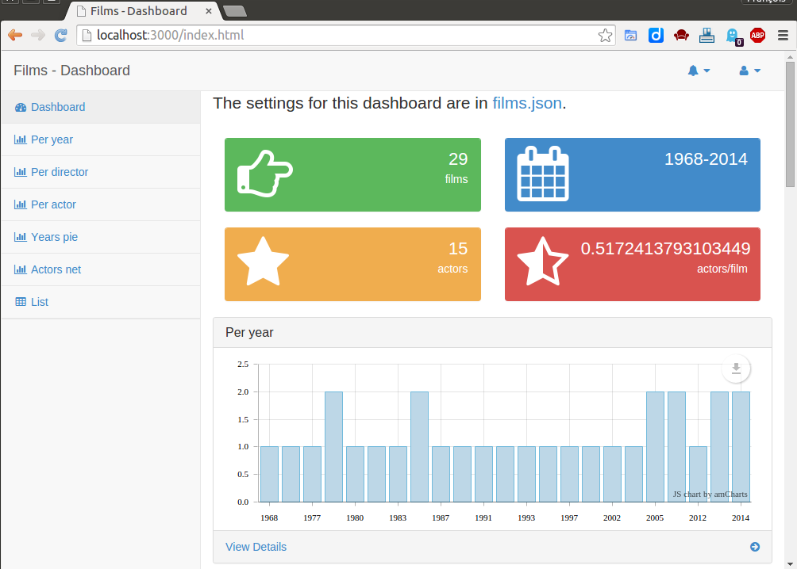

**ezVIS** is a web dashboard to visualize a synthesis on a structured corpus, using several charts (pies, histograms, ...), powered by
[castor](https://github.com/castorjs/castor-core/), and based on 
[SB Admin v2.0](http://startbootstrap.com/templates/sb-admin-2/).

ezVIS stands for easy **vis**ualization of information in web report.

# [Installation](Installation.md)

# [Getting Started](GettingStarted.md)

# Configuration

- [JSON file](ConfigurationFile.md)
- [documentFields](DocumentFields.md)
- [corpusFields](CorpusFields.md)
- [flyingFields](FlyingFields.md)
- [Access restriction](Access.md)

# Dashboard
- [Introduction](Dashboard.md)
- [histogram](Histogram.md)
- [horizontalbars](HorizontalBars.md)
- [pie](Pie.md)
- [map](Map.md)
- [network](Network.md)
- [Charts' Preferences](Preferences.md)
- [Facets](Facets.md)

# Chart parameters
- [fields](Fields.md)
- [operator](Operators.md)
- [flying](Flying.md)

# Pages
- [Documents table](Documents.md)
- [Document's page](Display.md)
- [Pages' labels and texts](Pages.md)

# Data
- [Loaders by format](Loaders.md)

# Annexes
- [JBJ](JBJ.md)
- [Showcase](Showcase.md)
- [Blog](MADEC.md)
- [Thanks](PoweredBy.md)